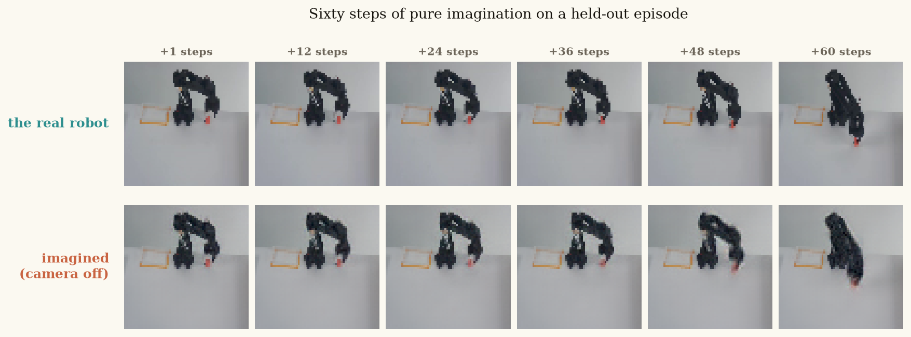
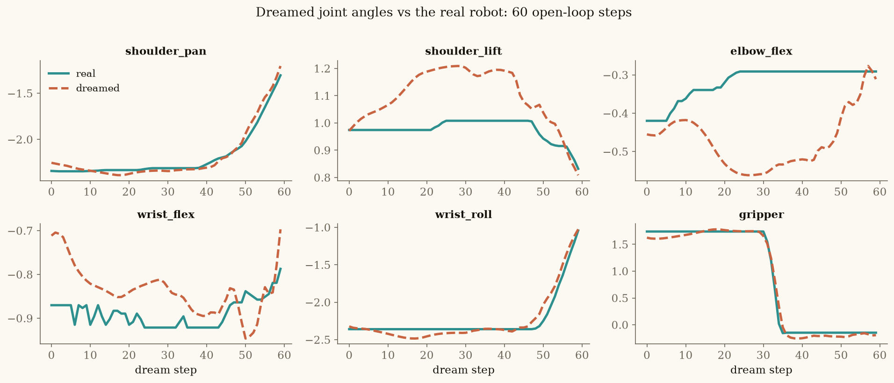
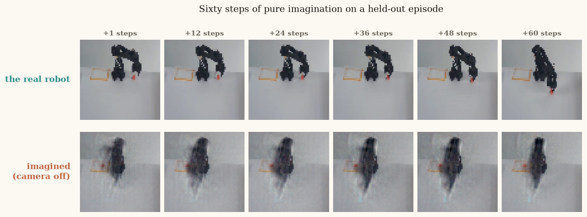
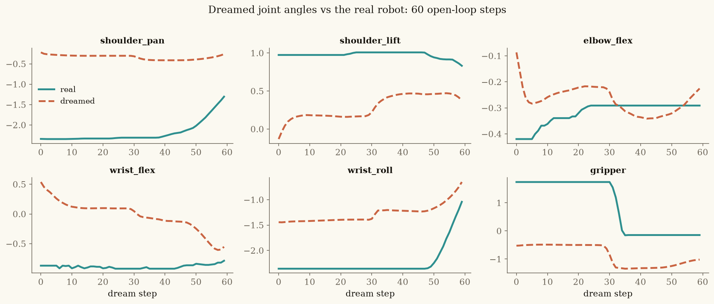

# Dreams That Last ft. RSSM on SO-101

Local, modular version of the companion notebook for **Lecture 4** of
*Build a World Model from Scratch* by Rajat Dandekar.

Trains a Recurrent State-Space Model (RSSM) on 12 episodes of
tele-operated pick-and-place data from an SO-101 arm, then dreams
60 steps into the future with the camera off.

---

## Table of contents

- [Project structure](#project-structure)
- [Quick start](#quick-start-macos)
- [CLI flags](#cli-flags)
- [Outputs](#outputs)
- [Playbook: what the code does and why](#playbook-what-the-code-does-and-why)
  1. [The big picture](#1-the-big-picture-in-one-paragraph)
  2. [The dataset](#2-the-dataset-datapy)
  3. [The model](#3-the-model-modelpy)
  4. [Training](#4-training-trainpy)
  5. [Evaluation](#5-evaluation-evaluatepy)
  6. [The flow, top to bottom](#6-the-flow-top-to-bottom)
  7. [Key dimensions](#7-key-dimensions-to-keep-in-your-head)
  8. [Connection to Dreamer](#8-connection-to-the-broader-dreamer-lineage)
  9. [Things to experiment with](#9-things-to-experiment-with)

---

## Project structure

```
rssm_so101/
  rssm/
    config.py      -- hyperparameters, paths, plotting style
    data.py        -- download + load + batch sampling
    model.py       -- Encoder, Decoder, RSSM
    train.py       -- training loop
    evaluate.py    -- dreaming, linear probe, ablation
    visualize.py   -- all matplotlib plotting
  main.py          -- CLI entry point (runs everything)
  requirements.txt
```

## Quick start (macOS)

### Using `uv` (recommended)

```bash
cd rssm_so101

# initialize the project (creates pyproject.toml + .venv)
uv init --bare

# add dependencies
uv add numpy torch matplotlib

# run -- downloads data automatically on first run
uv run python main.py
```

### Using plain `venv` + `pip`

```bash
python3 -m venv .venv
source .venv/bin/activate
pip install -r requirements.txt
python main.py
```

No manual data download is needed either way. On first run, `main.py`
calls `download_data()`, which pulls three files (~15 MB total) from
GitHub into `data/` and `checkpoints/`:

```
downloading data/so101_mini.npz ...
downloading data/so101_norm.npz ...
downloading data/rssm_so101.pt ...
all files ready
```

On a Mac with Apple Silicon, PyTorch uses the MPS backend automatically
(`device: mps`), so training genuinely runs on your GPU rather than
falling back to CPU. Training 600 steps takes roughly 10-15 minutes on
M1/M2. Either way, the pretrained checkpoint (21k steps) is loaded for
the evaluation sections, so you get full results even if you skip
training.

## CLI flags

| Flag              | Effect                                                   |
|-------------------|----------------------------------------------------------|
| `--train`         | Force training even on CPU                               |
| `--steps N`       | Set training steps (default 600)                         |
| `--skip-plots`    | Skip all visualizations, print numbers only              |
| `--no-pretrained` | Skip the pretrained checkpoint, use your own trained model |
| `--tag NAME`      | Extra label for the output folder (e.g. `koopman`)       |

## Outputs

Each run saves to a subfolder under `outputs/` named after the
hyperparameters, so different experiments never overwrite each other:

```
outputs/
  H256_S32_pretrained/          # default run (pretrained checkpoint)
  H32_S32_steps2000/            # H=32 ablation
  H256_S0_steps5000/            # stochastic path removed
  H256_S32_steps2000_koopman/   # with --tag koopman
```

Each folder contains all 8 PNGs and, for trained runs, the
`checkpoint.pt` for that experiment.

---

## Playbook: what the code does and why

A complete walkthrough of what this codebase does, why each piece
exists, and how the data flows from raw robot episodes to 60-step
dreams.

### 1. The big picture in one paragraph

You have 12 short videos of a robot arm picking up a cube. Each video
is a sequence of (camera frame, joint angles, joint commands). The goal
is to build a model that, after seeing just 5 real frames, can turn the
camera off and *imagine* what the robot will look like for the next 60
steps given only the joint commands. The architecture that makes this
work is the RSSM (Recurrent State-Space Model), originally from
Hafner et al.'s PlaNet/Dreamer line. This codebase is the cleanest
possible implementation of it on real hardware.

### 2. The dataset (`data.py`)

#### What you're working with

The data comes from `lerobot/svla_so101_pickplace`, a collection of
tele-operated pick-and-place episodes on an SO-101 arm. The notebook
uses a 12-episode subset. Each episode is a dictionary with three arrays:

| Key       | Shape          | What it is                                  |
|-----------|----------------|---------------------------------------------|
| `frames`  | (T, 64, 64, 3) | Camera images, uint8, 0-255                |
| `states`  | (T, 6)         | True joint angles (the 6 DOF of the arm)   |
| `actions` | (T, 6)         | Joint commands that were sent to the robot  |

The 6 joints are: `shoulder_pan`, `shoulder_lift`, `elbow_flex`,
`wrist_flex`, `wrist_roll`, `gripper`.

#### Normalization

`so101_norm.npz` stores per-joint mean and std for both states and
actions, computed over the full 50-episode dataset. Every time states
or actions enter the model, they get z-scored:

```
state_normed = (state - s_mean) / s_std
action_normed = (action - a_mean) / a_std
```

Frames are just divided by 255 to get [0, 1].

#### Train/eval split

The last 4 episodes (`HOLD_OUT = 4`) are never trained on. When you see
the model dream on `episodes[-2]`, that's a genuinely unseen episode.

#### Batch sampling (`sample_batch`)

Each training step grabs `B=8` random subsequences of length `L=24`
from the training episodes. For each batch element, it picks a random
episode, picks a random start index, and slices out 24 consecutive
timesteps. This is a standard "random window" strategy for sequence
model training.

### 3. The model (`model.py`)

#### The core idea: two kinds of memory

The RSSM splits its latent state into two halves at every timestep:

**h (256 numbers)** -- the deterministic belt. Updated by a GRU, never
sampled. This is where facts live. If the model sees the cube on the
table at step 10, that fact can survive in h indefinitely because
nothing random ever corrupts it. Think of it as the "I know for sure"
channel.

**s (32 numbers)** -- the stochastic sample. Drawn from a Gaussian
every single step. This is where doubt lives. When the gripper is
closing and the cube might have shifted by a millimeter in any
direction, s is what lets the model say "the future could go several
ways" instead of averaging them into a blur.

The decoder always reads both: `[h, s]` concatenated into a 288-dim
vector. And critically, s feeds back into the next h (via the GRU
input), so a resolved doubt becomes a remembered fact.

#### Why not just one or the other?

This is the key insight of the whole architecture, and the ablation
study at the end proves it empirically:

**Deterministic only (Design A):** No sampling anywhere. The GRU carries
a single vector forward. Strength: facts survive forever. Weakness: at a
fork in the future (e.g. did the gripper grab the cube or slip?), it
must output one answer, which under MSE loss becomes the average of all
possible futures. A frame that never actually occurs. Joint error at 60
steps: **0.409**.

**Stochastic only (Design B):** The state is redrawn from scratch every
step. Strength: can represent multiple futures. Weakness: every fact must
survive a fresh dice roll every step. Fifteen occluded frames means
fifteen consecutive lucky rolls. It won't happen. Joint error at 60
steps: **2.598** (worst of all three).

**RSSM (both):** Facts live in h, doubt lives in s, they feed each
other. Joint error at 60 steps: **0.009**. That's 45x better than
deterministic-only and 288x better than stochastic-only.

#### The components

**Encoder** (`Encoder`): A 4-layer CNN that compresses a 64x64x3 frame
(12,288 numbers) down to a 1024-dim embedding. The architecture is
straightforward: four `Conv2d(4,2,1)` layers with ELU activations that
halve spatial dimensions each time (64 -> 32 -> 16 -> 8 -> 4), then
flatten (256 * 4 * 4 = 4096) and project to 1024. The input gets
centered by subtracting 0.5 (since frames are in [0,1]).

**Decoder** (`Decoder`): The mirror. Takes `[h, s]` (288-dim), projects
to 4096 via a linear layer, reshapes to (256, 4, 4), then four
`ConvTranspose2d` layers upsample back to 64x64x3. The `+0.5` at the
end undoes the encoder's centering, bringing output back to [0,1] range.

**GRU cell** (`self.gru`): A standard `GRUCell(256, 256)`. Input is the
output of `in_mlp`, which merges the previous stochastic sample s and
the previous action a through a linear layer + ELU. The GRU is the
"deterministic belt" -- it's the only recurrent connection in the model
and it never involves any sampling.

**Prior MLP** (`self.prior_mlp`): `h -> (mu, sigma)` for s. This is the
*blind* guesser. It only sees the deterministic memory, not the current
frame. During dreaming (camera off), this is all you have. It outputs
64 numbers: 32 for the mean, 32 for the raw std (which gets
`softplus + 0.1` to ensure it's positive and bounded away from zero).

**Posterior MLP** (`self.post_mlp`): `[h, emb] -> (mu, sigma)` for s.
This is the *peeking* guesser. Same output format as the prior, but it
also gets the encoder's embedding of the current frame. During training,
you always sample from the posterior because it's more accurate.

**Joint head** (`self.joint_head`): `[h, s] -> 6 numbers`. An auxiliary
readout that predicts the 6 joint angles from the latent state. This
isn't needed for the world model itself -- it exists purely to make the
latent legible and to provide a clean evaluation metric (joint-angle
error) that isn't dominated by the static table and background the way
pixel error is.

#### The `dist` method

```python
def dist(self, out):
    mu, raw_std = out.chunk(2, -1)
    return mu, F.softplus(raw_std) + MIN_STD
```

Both the prior and posterior output 64 numbers. The first 32 are the
mean, the last 32 are passed through softplus (smooth ReLU) plus a
floor of 0.1. The floor (`MIN_STD`) prevents the distribution from
collapsing to a point, which would kill the stochastic channel.

### 4. Training (`train.py`)

#### The fundamental problem

There are no state labels in this dataset. Nobody can tell you "at
timestep 47, the correct latent state is [0.3, -1.2, ...]" because
the state is the model's own invented representation. Training has to
derive the learning signal entirely from things we *do* have: frames,
actions, and joint angles.

#### The two losses

**Loss 1 -- Reconstruction (repaint the frame):**

```python
l_rec += ((model.dec(h, s) - fr[:, t]) ** 2).sum(dim=(1,2,3)).mean()
```

Decode `[h, s]` back into an image and compare pixel-by-pixel with
what the camera actually saw. This is MSE over the full 64x64x3 image,
summed over pixels and averaged over the batch. Without this, the
latent could be anything -- there'd be no pressure to actually encode
the visual scene. **Loss 1 fills the state with content.**

But it's not enough alone. Lecture 3 showed that a model with only
reconstruction loss can repaint frames perfectly while being totally
unable to predict forward. The state can be "repaintable but
unrollable."

**Loss 2 -- KL divergence (make the guesses agree):**

At every timestep, the model computes s in two ways:
- The **posterior** q(s|h, frame) -- sees the frame, so it's accurate
- The **prior** p(s|h) -- blind, only sees the memory

Loss 2 is the KL divergence between these two distributions. By
minimizing it, you're training the blind guess to match the informed
one. The only way the prior can win this game is to genuinely carry
forward whatever information determines the next frame. **Loss 2 makes
what's in the state forecastable.**

And it pulls both ways: the posterior is also penalized for encoding
things the prior could never anticipate, so perception is pushed toward
representations that are predictable in the first place. This is the
variational information bottleneck in action.

#### KL balancing

```python
k = (0.8 * kl(qm.detach(), qs.detach(), pm, ps).mean()
   + 0.2 * kl(qm, qs, pm.detach(), ps.detach()).mean())
```

This is a trick from Dreamer v2. Instead of sending the full KL
gradient to both the prior and posterior equally, you split it:

- **80% of the gradient trains the prior** (first term: posterior is
  detached). This says "prior, move toward the posterior."
- **20% of the gradient trains the posterior** (second term: prior is
  detached). This says "posterior, don't encode things the prior can't
  predict."

The asymmetry makes the prior do most of the work of matching, while
gently discouraging the posterior from being unnecessarily complex.

#### Free nats

```python
l_kl += torch.clamp(k, min=free_nats)
```

If the KL is already below 1.0 nat, stop pushing. This prevents the
model from wasting capacity on making the two distributions identical
at the cost of reconstruction quality. It's a safety valve: "close
enough is close enough."

#### Joint head loss

```python
l_joint += ((model.joint_head(cat([h, s], -1)) - st[:, t]) ** 2).sum(-1).mean()
```

An auxiliary MSE loss on the 6 joint angles. This is weighted 10x in
the final loss (`10.0 * l_joint`), which makes sense because it's
6 numbers vs 12,288 pixels. It forces the latent to be legible in
terms of the robot's physical configuration, not just visually
decodable.

#### The training step, end to end

For one gradient step:

1. Sample a batch of 8 random 24-step windows from training episodes
2. Encode all B*L frames in one shot (batched CNN forward pass)
3. Initialize h and s to zeros
4. Unroll the sequence step by step:
   - Advance h via the GRU (using previous s and a)
   - Compute prior and posterior distributions for s
   - Sample s from the posterior (training uses the informed guess)
   - Accumulate reconstruction loss, joint loss, and KL loss
5. Combine: `total = (l_rec + 10 * l_joint + 1 * l_kl) / L`
6. Backprop through the entire unrolled sequence
7. Clip gradients at norm 100.0, Adam step

The division by L normalizes per-timestep so the loss scale doesn't
depend on sequence length.

### 5. Evaluation (`evaluate.py`)

#### Test 1: Linear probe (`linear_probe`)

The question: what is h actually carrying? The answer technique:

1. Run the trained model over all training episodes, recording h (256-d)
   and the true joint angles (6-d) at every timestep
2. Fit a single linear regression: `W = lstsq(H, Y)` (with a bias
   column appended to H)
3. Compute R-squared per joint: how much variance in each joint angle
   is explained by a simple linear readout of h?
4. As a control, shuffle the labels and fit again. Real structure should
   give R-squared near 1.0; shuffled should be near 0.

The result: R-squared is essentially 1.0 for all 6 joints. The
deterministic memory isn't carrying "a vector" -- it's carrying the
entire arm configuration, and it built that representation on its own
because predicting frames required it. The shuffled control sits at
zero, confirming this isn't an artifact of high dimensionality.

#### Test 2: Dreaming (`dream`)

The real test. Two phases:

**Warm-up (5 steps, camera ON):** Run the model normally, using the
posterior at each step (it can see the frame). This builds up a
reasonable h and s that summarize the recent history.

**Dream (60 steps, camera OFF):** Now switch to the prior only. At
each step:
- Advance h via the GRU using the previous s and the real action
- Compute s from the prior (blind guess -- no frame available)
- Decode `[h, s]` into an imagined frame
- Read out predicted joint angles via the joint head

The actions fed during dreaming are the *real* actions that were sent
to the robot. So the question is: given what actually happened, can the
model imagine what it would have looked like?

#### Test 3: Ablation (`dream_variant`)

Same trained model, same episode, same actions. Only the wiring changes
during the dream phase:

**`freeze_s`:** After warm-up, stop updating s. Keep the last
posterior sample forever. The GRU still runs, still receives s, but s
never changes. This tests what happens when the stochastic channel
stops expressing new doubts. The dream degrades because resolved
uncertainty can't be updated.

**`starve_h`:** During dreaming, feed `zeros` instead of s into the
GRU. The prior still computes new s values from h, but h never learns
what s decided. This cuts the feedback loop where "a resolved doubt
becomes a remembered fact." The dream degrades because the memory
can't incorporate stochastic resolutions.

**`both`:** Normal RSSM operation. Both paths are active. The dream
stays coherent.

#### Uncertainty over time (`uncertainty_over_time`)

Run the posterior over a full episode and record the mean std of
the stochastic distribution at each timestep. The expected finding:
uncertainty is maximal at t=0 (no history) and collapses after a single
frame. The *hoped-for* finding (that uncertainty spikes at the gripper
contact moment) doesn't show up, likely because 50 episodes of
successful grasps don't give the model much reason to be uncertain
at contact.

### 6. The flow, top to bottom

Here's exactly what happens when you run `python main.py`:

```
1. Download 3 files (~15 MB) from GitHub
      so101_mini.npz   -- 12 episodes of frames/states/actions
      so101_norm.npz   -- normalization statistics
      rssm_so101.pt    -- pretrained checkpoint (21k steps)

2. Load and inspect the dataset
      Plot one row: frame + joint angles + actions
      Plot the "fork" where the gripper closes

3. Build the RSSM (~7.7M parameters)

4. If GPU/MPS available: train 600 steps (~10-15 min)
      Plot the three loss curves

5. Load the pretrained checkpoint (21k steps)

6. Test 1: Linear probe
      Fit h -> joint angles, plot R-squared per joint

7. Test 2: Dream 60 steps on a held-out episode
      Plot real vs imagined frames side by side
      Plot real vs dreamed joint-angle curves

8. Test 3: Ablation
      Run freeze_s, starve_h, and both variants
      Plot 4-row comparison

9. Uncertainty analysis
      Plot posterior std over time for one episode
```

### 7. Key dimensions to keep in your head

| Symbol | Size | Lives in | Role |
|--------|------|----------|------|
| frame  | 64 x 64 x 3 = 12,288 | observation | raw camera image |
| emb    | 1,024 | encoder output | compressed frame |
| h      | 256 | GRU hidden | deterministic memory (facts) |
| s      | 32 | sampled | stochastic state (doubt) |
| [h, s] | 288 | concatenated | full state fed to decoder + joint head |
| a      | 6 | input | joint commands |
| state  | 6 | labels | true joint angles (for eval only) |

### 8. Connection to the broader Dreamer lineage

This is essentially a minimal PlaNet/Dreamer v1 world model. In the
full Dreamer stack, you would add:

- An **actor-critic** that learns a policy entirely inside the dream
  (no real environment interaction needed to improve the policy)
- **Categorical latents** instead of Gaussians (Dreamer v2+)
- **Symlog predictions** and other stabilization tricks (Dreamer v3)
- **Larger CNN / transformer** backbone for higher-res images

But the core insight -- split the state into a deterministic path for
facts and a stochastic path for doubt, train them jointly with
reconstruction + KL -- is exactly what this code implements. Everything
else is engineering on top of this foundation.

### 9. Things to experiment with

Directly from the notebook's exercise list, mapped to where you'd
make the change:

1. **Break the prior/posterior asymmetry**: In `model.py`, change
   `prior_mlp` to also take `emb` as input. The KL collapses to
   zero and the dream falls apart.

2. **Shrink h**: In `config.py`, set `H = 32`. Retrain. See which
   test breaks first.

3. **Remove the stochastic path**: Set `S = 0`, have the decoder
   read h alone. Reproduce the deterministic-only ablation.

4. **Hunt the missing spike**: In `evaluate.py`, modify
   `uncertainty_over_time` to return per-dimension std instead of the
   mean. Plot all 32 dimensions around the grasp timestep.

5. **Dream past 60**: In `config.py`, set `HORIZON = 200`. See where
   it breaks and what breaks first.

---

## Results

### Baseline: H=256, S=32 (pretrained, 21k steps)

The pretrained RSSM with a 256-d deterministic memory and 32-d
stochastic state, trained for 21,000 steps on 8 training episodes.

**Linear probe:** R-squared near 1.0 for all 6 joints. A plain
linear readout of the deterministic memory h recovers the full arm
configuration, from a representation that was never supervised on
joint angles.

**60-step dream on a held-out episode:**

| Step | Joint error |
|------|-------------|
| 1    | 0.0081      |
| 30   | 0.0210      |
| 60   | 0.0036      |

The dream does not degrade monotonically. Error drifts mid-sequence
and re-converges by step 60, suggesting attractor-like dynamics in
latent space.

**Ablation (same weights, modified wiring):** Cutting the information
flow from s into h (`starve_h`) visibly degrades the dream. Freezing
s (`freeze_s`) hurts less on this episode but still produces subtle
drift. Both channels are load-bearing.




### Experiment: H=32, S=32 (retrained, 2k steps)

Same architecture, same data, same training recipe. Only the
deterministic memory was shrunk from 256 to 32 dimensions.
Retrained for 2,000 steps on MPS.

**Parameters:** 6,209,545 (vs 7,665,993 for H=256)

**Training:** All three losses converge to roughly the same floor as
the H=256 model. The loss curves do not reveal the problem.

**Linear probe:** R-squared 0.985-0.997 for all joints. The probe
survives. 32 dimensions is more than enough to linearly encode 6
joint angles.

**60-step dream on the same held-out episode:**

| Step | Joint error |
|------|-------------|
| 1    | 2.2991      |
| 30   | 2.0414      |
| 60   | 0.3791      |

The dream is broken from step 1. Joint error is ~280x worse than the
H=256 baseline. Imagined frames dissolve into blurry blobs by step 12
and are unrecognizable by step 36.

**Ablation:** All three wiring variants (frozen, starved, both) look
equally bad. When the base model cannot dream, the ablation cannot
distinguish between configurations.




### What this tells us

The probe survived. The dream didn't.

A 32-d deterministic memory is enough to **describe** the current
state but not enough to **propagate** it through time. The GRU needs
those extra dimensions not for the current-moment snapshot but for
maintaining temporal context: what happened during occlusion, where
the cube was before the hand blocked it, how the trajectory was
trending.

This cleanly separates two roles of h that are easy to conflate:
**encoding the present** vs **remembering the past**. H=32 can do
the first. Only H=256 can do both.

---

## Credits

This project is based on the companion notebook for Lecture 4 of
[Build a World Model from Scratch](https://www.youtube.com/watch?v=gNwczJjm-8o)
by **Rajat Dandekar** (Vizuara AI). The original dataset, model
architecture, training logic, and evaluation suite are his work.

This repo restructures the Colab into a modular local codebase and
adds the H-ablation experiment and run-management tooling.
